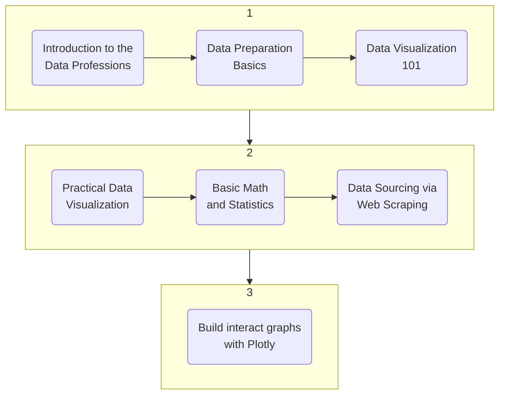

### **1. Introduction to the Data Professions**
**Introduction to the data professions**  
Data science, data engineering, data analytics and business intelligence all work together to generate business value from data. Focus on mastering one area at a time.  
Data science is the systematic study of the structure and behaviour of data in order to quantifiably understand past and current occurences, as well as predict the future behaviour of data.  
Traits of data scientists:
- Are interested in *why* rather than *how*. Once we understand why something happens the way it does, we can make predictions on *how* it will happen.
- Derive insights from data, including big data (data from data engineered systems).
- Uncover correlations and causations in business data to support business decision-making
- Generate predictions from data and communicate predictions through data visualization.
 

Data engineering is the design, construction and maintenance of data systems. More interested in *how* rather than *why*. 
Typical tasks of data engineers:
- Design systems to collect, handle and store big datasets.
- Build modular, scalable platforms for data processing.
- Design, build and maintain systems that store and move big data.
 

Data analytics are data products that describe data and how it behaves. These data products are generated from data analysis and visualisation processes. Less software engineering involved. 
- Use applications to analyze data.
- Solid in basic mathematics.
- Understand the inner workings of a business very well.
- Enjoys using data insights to improve business.
- Not into deep analyses.
 
 

**The four flavours of data analysis**
- *Data analysis*: a process for making sense of data. Include data cleaning, reformatting, and recombining data. Carried out with the express intention of discovering trends, patterns and findings in data that describe real-life phenomena.
- *Data science*: the systematic study of the structure and behaviour of data in order to quantifiably understand past and current occurences, as well as predict the future behaviour of that data.
- *Artificial intelligence*: a machine or application with the capacity to autonomously execute upon predictions it makes from data. Two main elements: prediction (predictive modeling from data science), and execution (autonomous response, from engineering).
- *Deep learning*: a set of predictive methodologies that borrows its structure from the neural network structures of the brain. This class of methods is particularly effective for making predictons from big data. A sub-field within data science. Can be used as a decision model with applications to produce deep learning AI.
 
 

**Why use Python for analytics?**
- Easy to learn, human readable
- Extensive array of well-supported data science libraries
- Biggest user base of all data science languages
- Useful in data engineering
 
Useful for data science, data analytics, data engineering. Useful in both a professional and an academic environment. Open-source, can be used in both web and application development. 
Main Python libraries for data science include:
- Advanced Data Analysis: `NumPy`, `SciPy`, `s`
- Data Visualisation: `Matplotlib`, `Seaborn`
- Machine Learning: `scikit-learn`, `TensorFlow`, `Keras`
 
 

**High-level course roadmap**

 
 
 

### **1. Data Preparation Basics**
**Filtering and selecting** 
Pandas: a data analytics library. 
*Why pandas?* - fast data cleaning, preparation, and analysis; easy to use for data visualisation and machine learning. 
*What is pandas?* - built on top of NumPy, makes it easy to work with arrays and matrices.  *Indexing in pandas:* An index is a list of integers or labels you use to uniquely identify rows or columns. This course will use a set of square brackets `[...]`, or the `.loc[]` indexer. 
*DataFrame Object:* acts like a spreadsheet in Excel, made of a set of Series objects, and are indexable. 
*Series Object:* a single row or column. Always indexed. 
Refer to the Jupyter notebook for code examples.
 
 

**Treating missing values** 
By default, missing values are represented with NaN: 'Not a Number' 
Warning: if your dataset has `0s`, `99s`, or `999s`, be sure to either drop or approximate them as you would with missing values. 
Refer to the Jupyter notebook for code examples.
 
 

**Removing duplicates** 
We remove duplicates to maintain accurate, consistent datasets and to avoid producing erroneous or misleading statistics.
 
 

**Concatenating and transforming** 
Concatenating - combining. Transforming - changing to suit our purposes.
 
 

**Subgrouping and aggregation** 
Useful for categorizing data. 
Can group data to compare subsets, deduce reasons why subgroups differ, and can subset your data for analysis.
 
 
 

### **2. Data Visualization 101**
**The three types of data visualization** 
- *Data storytelling* (for presentations to organizational decision makers).   Make it easy for the audience to get the point. Must be clutter-free and highly organised. Audience are nonanalysts and nontechnical business managers. Types include static images and simple dashboards.s 
- *Data showcasing* (for presentations to analysts, scientists, mathematicians, engineers).   Showcase a lot of data so that your audience members can think for themselves. Opposite to data storytelling. Must be highly contextual, include background information, open ended. Analysts, quants, engineers, mathematicians, scientists. Static images and interactive dashboards.
- *Data art* (for presentations to activists or to the general public).   Use data art to make a statement. Should be attention-getting, creative, controversial. Idealists, artists, social activists. Static images.
 
 

**Selecting optimal data graphics** 
- Raster Maps: a raster file filled with values according to count. Like a heatmap on top of a map. Uses one count.
- Cloropleths: a map that shows area boundaries.
- Point Maps: a map that has points on it.
 
- *Data Storytelling*: area, bar, line, pie, cloropleth, point maps.
- *Data Showcasing*: area, bar, line, pie, cloropleths, point maps, histograms, scatter plots, scatter plot matrices, raster maps.
- *Data Art*: line, graph networks, cloropleths, etc...
 
*Four steps to choosing data graphics*:
1. Make a list of the questions that your data visualisation is meant to answer.
2. Is your data visualisation type story telling, data showcasing, or data art?
3. What data graphic types are preferable for that type of data visualisation?
4. Test out different types of data graphics with your data. Which graphic type displays the most clear and obvious answer to your questions?
 
 

**Communicating with color and context** 
Colour should be used:
- Strategically
- Sparingly
- Consistently

You want to use colour to draw attention to the parts of the visualization that matter, and away from the parts that don't. Ensure that all colours are all from the same colour formula (consistency).  
Use annotations as context; provide information in why data is as it is. Can also bring in graphic elements as context - for example, trendlines etc.
 
 
 

### **3. Practical Data Visualisation** 
**Creating standard data graphics** 

 
 

**Defining elements of a plot** 

 
 

**Plot formatting** 

 
 

**Creating labels and annotations** 

 
 

**Visualising time series** 

 
 

**Creating statistical data graphics** 

 
 
 
